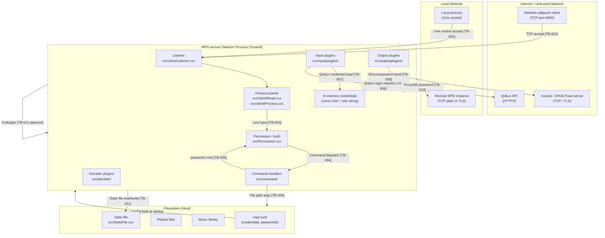

# MPD-secure Formal STRIDE Threat Model

**Status:** Living document — update as mitigations are implemented
**Feature:** [FEATURE-007](../features/FEATURE-007-stride-threat-model.md)
**GitHub Issue:** https://github.com/devinhedge/MPD-secure/issues/7
**Last reviewed:** 2026-03-18

---

## Table of Contents

1. [Protected Asset Inventory](#1-protected-asset-inventory)
2. [Severity Rubric](#2-severity-rubric)
3. [Adversary Profiles](#3-adversary-profiles)
4. [Architecture and Trust Zone Diagram](#4-architecture-and-trust-zone-diagram)
5. [Trust Boundary Catalog](#5-trust-boundary-catalog)
6. [STRIDE Analysis by Component](#6-stride-analysis-by-component)
7. [Vulnerability Catalog](#7-vulnerability-catalog)
8. [Threat-to-Feature Traceability Matrix](#8-threat-to-feature-traceability-matrix)
9. [Accepted Risk Register](#9-accepted-risk-register)
10. [Living Document Process](#10-living-document-process)

---

## 1. Protected Asset Inventory

Every threat in this document is evaluated in terms of its impact on one or more of the following assets.

| Asset | Sensitivity | Authorized Accessors |
|---|---|---|
| Service account credentials (Qobuz, SHOUTcast) | Critical | Daemon process only |
| MPD client passwords (config) | High | Daemon process only |
| Music library filesystem paths | Medium | Authenticated MPD clients |
| Playlist files | Medium | Authenticated MPD clients (with ADD/CONTROL permission) |
| State file (playback state, queue) | Medium | Daemon process only |
| Daemon availability (playback) | Medium | Authorized clients |
| Network position (routing, lateral movement) | High | Not an asset to share |
| Config file contents | High | System administrator only |

---

## 2. Severity Rubric

| Severity | Exploitability | Impact | Example |
|---|---|---|---|
| Critical | Remotely exploitable with no auth, no user interaction | Full confidentiality, integrity, or availability loss | Unauthenticated full admin access via network |
| High | Remotely exploitable or requires minimal access | Significant data exposure, privilege escalation, or DoS | Credentials leaked to attacker on same LAN |
| Medium | Requires local access or specific conditions | Partial exposure, limited escalation, degraded availability | Path traversal limited to readable paths |
| Low | Requires privileged access or is difficult to exploit | Minimal impact, information leakage only | URL-encoding omission in internal request |

---

## 3. Adversary Profiles

Likelihood ratings in the STRIDE analysis reference these profiles explicitly.

| Profile | Access | Motivation | Capability |
|---|---|---|---|
| **NET** — Network-adjacent attacker | TCP port 6600 reachable (same LAN or misconfigured firewall) | Control playback, exfiltrate credentials, pivot to other LAN hosts | Can send arbitrary MPD protocol commands; cannot read process memory or files directly |
| **PLG** — Compromised plugin | Runs inside daemon process at plugin init/stream time | Exfiltrate credentials, tamper with audio, persist via config | Access to daemon process memory, may call internal APIs |
| **INS** — Insider with config access | Read/write access to `mpd.conf` and daemon config directory | Extract service credentials, escalate to daemon permissions | Can modify config before daemon starts; may have shell access |
| **SUP** — Supply chain attacker | Controls a third-party library or upstream MPD commit | Introduce backdoor, exfiltrate credentials at scale | Can modify code compiled into the daemon binary |

---

## 4. Architecture and Trust Zone Diagram

The diagram below shows the trust zones and boundaries in MPD-secure. Every arrow that crosses a zone boundary is a trust boundary and appears in the catalog in Section 5.

---

## 5. Trust Boundary Catalog

All boundaries at which untrusted input enters the system or credentials cross a zone.

| ID | Boundary | Location | What Crosses It | Current Protection |
|---|---|---|---|---|
| TB-001 | TCP socket accept | `src/client/Listener.cxx:32` | Any TCP client | None |
| TB-002 | Unix socket accept | `src/client/Listener.cxx:32` | Local process | File permissions (0600 XDG socket) |
| TB-003 | Line input parsing | `src/client/Read.cxx:13` | Arbitrary bytes | Line framing, lowercase-first check |
| TB-004 | Command dispatch | `src/command/AllCommands.cxx:382` | Command + args | Permission bitmask check |
| TB-005 | Password command | `src/command/ClientCommands.cxx:45` | Client password string | Map lookup; no rate limiting |
| TB-006 | File path arguments | Various command handlers | Unvalidated string paths | None |
| TB-007 | Qobuz credential load | `src/input/plugins/QobuzInputPlugin.cxx:113` | API credentials from config | None |
| TB-008 | Qobuz login request | `src/input/plugins/QobuzLoginRequest.cxx:19` | Password in HTTPS query string | HTTPS transport only |
| TB-009 | Proxy DB password | `src/db/plugins/ProxyDatabasePlugin.cxx:79` | Remote MPD password | Cleartext unless external TLS |
| TB-010 | Shout output password | `src/output/plugins/ShoutOutputPlugin.cxx:22` | Icecast/SHOUTcast password | TLS optional, depends on server config |
| TB-011 | State file read (startup) | `src/StateFile.cxx` | Daemon state from disk | Filesystem permissions only |
| TB-012 | State file write (runtime) | `src/StateFile.cxx` | Daemon state to disk | Filesystem permissions only |

---

## 6. STRIDE Analysis by Component

For each component, every applicable STRIDE category is evaluated. Threat status:

- **Unmitigated** — no control exists
- **Partial** — some control exists but is incomplete
- **Mitigated** — control exists and is sufficient

### 6.1 Network Listener (`src/Listen.cxx`, `src/client/Listener.cxx`)

| STRIDE | Threat | Likelihood | Impact | Adversary | Status | Mitigating Feature |
|---|---|---|---|---|---|---|
| Spoofing | Any TCP client connects and impersonates a legitimate client | High | High | NET | Unmitigated | FEATURE-004 |
| Tampering | Attacker modifies commands in transit (no TLS) | Medium | High | NET | Unmitigated | FEATURE-004 |
| Repudiation | No logging of who connected or what commands they sent | High | Medium | NET, INS | Unmitigated | FEATURE-008 |
| Information Disclosure | Port 6600 bound to all interfaces by default; presence of daemon disclosed | High | Low | NET | Partial (firewall outside scope) | FEATURE-004 |
| Denial of Service | Exhaust connection slots with unauthenticated TCP connections | High | Medium | NET | Unmitigated | FEATURE-004 |
| Elevation of Privilege | SO_PEERCRED available on Unix socket but unused; UID-based authz not implemented (V-008) | Medium | Medium | NET | Unmitigated | FEATURE-004 |

### 6.2 Client Protocol Parser (`src/client/Read.cxx`, `src/client/Process.cxx`)

| STRIDE | Threat | Likelihood | Impact | Adversary | Status | Mitigating Feature |
|---|---|---|---|---|---|---|
| Spoofing | Attacker sends commands that mimic legitimate client operations | High | High | NET | Partial (permission check) | FEATURE-004 |
| Tampering | Malformed command causes undefined behavior | Low | High | NET | Partial (16 KB buffer, lowercase check) | FEATURE-002 |
| Repudiation | Commands processed without attribution or audit log | High | Medium | NET | Unmitigated | FEATURE-008 |
| Information Disclosure | Error messages reveal internal state or command existence | Low | Low | NET | Partial | FEATURE-002 |
| Denial of Service | Flood of valid or malformed commands saturates event loop | High | Medium | NET | Unmitigated | FEATURE-004 |
| Elevation of Privilege | Command injection via unexpected argument format | Low | High | NET | Partial (tokenization) | FEATURE-002 |

### 6.3 Permission and Authentication System (`src/Permission.cxx`)

| STRIDE | Threat | Likelihood | Impact | Adversary | Status | Mitigating Feature |
|---|---|---|---|---|---|---|
| Spoofing | Client presents another client's password (no per-session identity) | High | High | NET | Unmitigated (V-001) | FEATURE-004 |
| Tampering | N/A — auth system is read-only at runtime | — | — | — | — | — |
| Repudiation | No record of which client authenticated with which password | High | Medium | NET | Unmitigated | FEATURE-008 |
| Information Disclosure | Timing oracle on map lookup leaks correct password prefix (V-001) | Medium | High | NET | Unmitigated | FEATURE-002 |
| Denial of Service | Brute-force with no rate limit or lockout (V-009) | High | Medium | NET | Unmitigated | FEATURE-004 |
| Elevation of Privilege | Default permission is full admin when no passwords configured (V-007) | High | Critical | NET | Unmitigated | FEATURE-004 |

### 6.4 Input Plugin System (`src/input/`)

| STRIDE | Threat | Likelihood | Impact | Adversary | Status | Mitigating Feature |
|---|---|---|---|---|---|---|
| Spoofing | Compromised plugin impersonates legitimate input source | Low | High | PLG, SUP | Unmitigated | FEATURE-003 |
| Tampering | Compromised plugin injects malicious audio data | Low | Medium | PLG, SUP | Unmitigated | FEATURE-003 |
| Repudiation | Plugin operations not audit-logged | Medium | Low | PLG | Unmitigated | FEATURE-008 |
| Information Disclosure | Qobuz credentials in URL, in memory without zeroing (V-002, V-004) | High | High | NET, PLG | Unmitigated | FEATURE-002, FEATURE-005 |
| Denial of Service | Plugin hangs on blocked I/O without timeout | Medium | Medium | NET | Partial (libcurl timeout) | FEATURE-003 |
| Elevation of Privilege | Plugin runs with full daemon privileges (V-004) | Medium | High | PLG, SUP | Unmitigated | FEATURE-003 |

### 6.5 Decoder Plugin System (`src/decoder/`)

| STRIDE | Threat | Likelihood | Impact | Adversary | Status | Mitigating Feature |
|---|---|---|---|---|---|---|
| Spoofing | N/A | — | — | — | — | — |
| Tampering | Compromised decoder plugin corrupts `DecoderControl` command field or holds mutex, stalling playback (V-012) | Low | Medium | PLG, SUP | Unmitigated | FEATURE-003 |
| Repudiation | Decoder errors not attributed or audit-logged | Low | Low | PLG | Unmitigated | FEATURE-008 |
| Information Disclosure | Decoder plugin has access to raw audio data in `MusicPipe` | Low | Low | PLG | Partial (process isolation absent) | FEATURE-003 |
| Denial of Service | Missed-wakeup in seek recovery loop (`Control.cxx:132`) can stall player thread (V-012) | Low | Medium | PLG | Unmitigated | FEATURE-003 |
| Elevation of Privilege | Decoder plugin runs with full daemon privileges | Low | High | PLG, SUP | Unmitigated | FEATURE-003 |

### 6.6 Output Plugin System (`src/output/`)

| STRIDE | Threat | Likelihood | Impact | Adversary | Status | Mitigating Feature |
|---|---|---|---|---|---|---|
| Spoofing | Compromised output plugin sends credentials to attacker-controlled server | Low | High | PLG, SUP | Unmitigated | FEATURE-003 |
| Tampering | Output plugin modifies audio stream before transmission | Low | Low | PLG | Unmitigated | FEATURE-003 |
| Repudiation | Shout/Icecast connection events not logged | Medium | Low | PLG | Unmitigated | FEATURE-008 |
| Information Disclosure | Shout password in memory without zeroing (V-005); output plugin access to raw PCM buffer (V-013) | High | High | PLG | Unmitigated | FEATURE-002, FEATURE-003, FEATURE-005 |
| Denial of Service | Output plugin thread race on `allow_play` flag stalls audio (V-013) | Low | Medium | PLG | Partial (mutex design) | FEATURE-003 |
| Elevation of Privilege | Output plugin runs with full daemon privileges | Low | High | PLG, SUP | Unmitigated | FEATURE-003 |

### 6.7 Credential Storage (In-Memory and Config File)

| STRIDE | Threat | Likelihood | Impact | Adversary | Status | Mitigating Feature |
|---|---|---|---|---|---|---|
| Spoofing | Attacker modifies `mpd.conf` before daemon starts to inject their own credentials | Low | Critical | INS | Partial (filesystem permissions) | FEATURE-005 |
| Tampering | Config file is world-readable; credentials extracted by non-root local user | Medium | Critical | INS | Partial (filesystem permissions) | FEATURE-005 |
| Repudiation | Credential access not logged | High | Medium | INS | Unmitigated | FEATURE-008 |
| Information Disclosure | All service credentials (Qobuz, Shout, ProxyDB) held as plaintext `const char*` for daemon lifetime, never zeroed (V-004, V-005, V-006) | High | Critical | PLG, INS | Unmitigated | FEATURE-002, FEATURE-005 |
| Denial of Service | N/A | — | — | — | — | — |
| Elevation of Privilege | Credentials in config file give read access to all service accounts | Medium | High | INS | Partial | FEATURE-005 |

### 6.8 Filesystem Access (Playlists, Library, State File)

| STRIDE | Threat | Likelihood | Impact | Adversary | Status | Mitigating Feature |
|---|---|---|---|---|---|---|
| Spoofing | N/A | — | — | — | — | — |
| Tampering | Unvalidated file paths allow path traversal to write outside playlist dir | Medium | Medium | NET | Unmitigated (V-010) | FEATURE-002 |
| Repudiation | Filesystem operations (playlist save, state write) not audit-logged | Medium | Low | NET | Unmitigated | FEATURE-008 |
| Information Disclosure | Path traversal allows reading files outside music library (V-010) | Medium | Medium | NET | Unmitigated | FEATURE-002 |
| Denial of Service | Attacker instructs daemon to read/stat large or non-existent paths | Low | Low | NET | Unmitigated | FEATURE-002 |
| Elevation of Privilege | State file has no integrity check; local attacker injects malicious state | Low | Low | INS | Unmitigated | FEATURE-002 |

### 6.9 Daemonization and Process Lifecycle (`src/unix/Daemon.cxx`)

| STRIDE | Threat | Likelihood | Impact | Adversary | Status | Mitigating Feature |
|---|---|---|---|---|---|---|
| Spoofing | N/A | — | — | — | — | — |
| Tampering | `setenv("HOME", ...)` before fork modifies environment; inherited by plugins/scripts | Low | Low | INS, PLG | Partial (limited exec surface) | FEATURE-002 |
| Repudiation | Daemon start/stop events not audit-logged with operator attribution | Medium | Low | INS | Unmitigated | FEATURE-008 |
| Information Disclosure | Privilege drop (GID before UID, supplementary groups) is correct; no credentials in process environment | Low | Low | INS | Mitigated | — |
| Denial of Service | SIGKILL cannot be caught; no graceful shutdown ensures state file written | Low | Low | INS | Partial | FEATURE-009 |
| Elevation of Privilege | Daemon runs as configured user; privilege drop sequence is correct | Low | Low | INS | Mitigated | — |

---

## 7. Vulnerability Catalog

Specific weaknesses found in the current codebase. Each entry maps to the STRIDE analysis above. Use this as the remediation backlog for FEATURE-002.

| # | STRIDE | Severity | Location | Description | Status |
|---|---|---|---|---|---|
| V-001 | Spoofing / Information Disclosure | High | `Permission.cxx:144-150`, `ClientCommands.cxx:47` | Client passwords stored in plaintext `std::map`; lookup uses `std::less<>` with early-exit byte comparison — classic timing oracle. No constant-time comparison (`CRYPTO_memcmp` or equivalent). No rate limiting on `password` command. | Unmitigated |
| V-002 | Information Disclosure | High | `QobuzLoginRequest.cxx:39-48` | Qobuz password sent as plaintext query parameter in HTTPS URL: `?password=<plaintext>`. Appears in server access logs, proxy histories, libcurl debug output, and heap memory after the request completes. | Unmitigated |
| V-003 | Tampering | Medium | `QobuzClient.cxx:170-199` | MD5 used for Qobuz API request signing (`MakeSignedUrl()`). MD5 is cryptographically broken (collision-vulnerable since 2004). Trivially forgeable by a compromised plugin or MITM on the Qobuz API. | Unmitigated |
| V-004 | Information Disclosure | High | `QobuzClient.hxx:26-28`, `QobuzInputPlugin.cxx:150` | Qobuz `app_id`, `app_secret`, `username`, and `password` held as raw `const char*` pointing into `ConfigBlock` for daemon lifetime. Never zeroed on cleanup (`FinishQobuzInput` calls `delete qobuz_client` without zeroing). Exposed in core dumps and `/proc/self/mem` reads. | Unmitigated |
| V-005 | Information Disclosure | High | `ShoutOutputPlugin.cxx:22-46` | Icecast/SHOUTcast password held as `const char *const passwd` in `ShoutConfig` and copied into `shout_t`. Neither copy is zeroed on `Disable()`. | Unmitigated |
| V-006 | Information Disclosure | High | `ProxyDatabasePlugin.cxx:79`, `449-451` | Remote MPD password sent over cleartext TCP via MPD `password` command (`mpd_run_password`). The `std::string password` field persists in heap for plugin lifetime; not zeroed in `Disconnect()` or `Close()`. | Unmitigated |
| V-007 | Elevation of Privilege | Critical | `Permission.cxx:78-80` | Default permission when no `password` stanza is configured is `PERMISSION_READ \| PERMISSION_ADD \| PERMISSION_PLAYER \| PERMISSION_CONTROL \| PERMISSION_ADMIN`. Any TCP client on port 6600 receives full admin rights with no authentication. No warning is emitted. | Unmitigated |
| V-008 | Elevation of Privilege | Medium | `client/Listener.cxx:15` | Peer UID available via `SO_PEERCRED` on Unix domain sockets; fetched by `GetPeerCredentials()` but immediately discarded: `(void)cred; // TODO: implement option to derive permissions from uid`. UID-based authorization not implemented. | Unmitigated |
| V-009 | Denial of Service | Medium | `AllCommands.cxx:140`, `ClientCommands.cxx:45-55` | No rate limiting, attempt counter, delay, or lockout on the `password` command. Registered with `PERMISSION_NONE` — any unauthenticated client can attempt passwords in a tight loop. Inactivity timeout is refreshed on each line received (`Read.cxx:23`), preventing disconnection during brute force. | Unmitigated |
| V-010 | Tampering / Information Disclosure | Medium | Various command handlers (`add`, `load`, `save`, `readcomments`, `readpicture`) | File path arguments passed as unvalidated strings to backend handlers. No normalization, no prefix-check against allowed directories. Path traversal risk (e.g., `../../etc/passwd`). | Unmitigated |
| V-011 | Information Disclosure | Low | `QobuzLoginRequest.cxx:28` | `// TODO: escape` comment acknowledges that credential parameters are appended to the URL without URL-encoding. If a username or password contains `&`, `=`, or `+`, it will be misinterpreted by the server or logged incorrectly. | Unmitigated |
| V-012 | Tampering / Denial of Service | Low | `src/decoder/Control.hxx:48`, `Control.cxx:125-135` | `DecoderControl` shared-memory IPC between player and decoder threads uses a mutex/cond pair shared with `PlayerControl`. A missed-wakeup window exists in the seek recovery loop (`Control.cxx:132`: "This is a kludge, built on top of the 'late seek' kludge"). A compromised decoder plugin that corrupts the `command` field or holds the mutex could stall playback indefinitely. | Unmitigated |
| V-013 | Information Disclosure | Low | `src/output/Control.hxx:31`, `Source.hxx:150-177` | `AudioOutputControl` runs the output plugin on its own thread with access to the raw PCM audio buffer (`MusicPipe` via `SharedPipeConsumer`). `Fill(mutex)` temporarily releases `AudioOutputControl::mutex` during pipe access. A compromised output plugin has an unlock window in which to read or copy the full PCM stream. | Unmitigated |

---

## 8. Threat-to-Feature Traceability Matrix

Every identified vulnerability maps to exactly one primary mitigating feature. No vulnerability is in an untracked state. Vulnerabilities marked `[MITIGATED by #X]` will be updated with the PR number when the mitigating feature is merged.

| Threat / Vuln | Primary Feature | Secondary Feature |
|---|---|---|
| V-001 (plaintext passwords, timing oracle, no rate limit) | FEATURE-002, FEATURE-004 (OAuth replaces password command) | — |
| V-002 (Qobuz password in URL) | FEATURE-002, FEATURE-005 (secure credential storage) | — |
| V-003 (MD5 signing) | FEATURE-002 | — |
| V-004 (Qobuz credentials in memory, no zeroing) | FEATURE-002, FEATURE-005 | — |
| V-005 (Shout password in memory, no zeroing) | FEATURE-002, FEATURE-005 | — |
| V-006 (ProxyDB cleartext) | FEATURE-004 (TLS/mTLS) | — |
| V-007 (default full admin) | FEATURE-004 (OAuth replaces permission system) | — |
| V-008 (UID-based authz unused) | FEATURE-004 | — |
| V-009 (no brute-force protection) | FEATURE-004 (OAuth replaces password command) | — |
| V-010 (unvalidated file paths) | FEATURE-002 | — |
| V-011 (unencoded URL params) | FEATURE-002 | — |
| V-012 (decoder thread IPC race) | FEATURE-003 (plugin sandboxing) | — |
| V-013 (output plugin PCM buffer access) | FEATURE-003 (plugin sandboxing) | — |

### Disposition Policy for Unmitigated Threats

Any threat in the STRIDE analysis table (Section 6) that is marked **Unmitigated** and does not appear in the vulnerability catalog (Section 7) is a structural threat addressed by architecture (FEATURE-003, FEATURE-004) rather than a specific code defect. These are tracked through the feature's Definition of Done rather than a per-vulnerability entry.

---

## 9. Accepted Risk Register

No threats are currently in accepted-risk status. All threats identified in this revision are assigned to active features. If a threat is accepted as residual risk in a future revision, the entry must include:

- Description of residual risk
- Rationale for acceptance
- Name of the contributor who accepted it
- Date of acceptance

---

## 10. Living Document Process

This document is updated as part of every security feature's Definition of Done.

### Update Rules

- Closed vulnerabilities are marked `[MITIGATED by #PR]` with the pull request number.
- Any new vulnerability discovered during implementation of another feature is added to Section 7 before that feature's PR is merged.
- Newly mitigated threats are moved from `Unmitigated` to `Mitigated` in the STRIDE tables (Section 6).
- The "Last reviewed" date at the top of this document is updated on every merge that touches it.

### Features That Must Update This Document

| Feature | Section to Update on Merge |
|---|---|
| FEATURE-002 (secure code practices) | V-001, V-002, V-003, V-004, V-005, V-010, V-011 status → Mitigated |
| FEATURE-003 (plugin sandboxing) | V-012, V-013 status → Mitigated; Section 6.4–6.6 updated |
| FEATURE-004 (TLS, mTLS, OAuth) | V-006, V-007, V-008, V-009 status → Mitigated; TB-001 updated |
| FEATURE-005 (secure credential storage) | V-002, V-004, V-005, V-006 status → Mitigated |
| FEATURE-006 (CI/CD security gates) | Section 10 updated with gate references |
| FEATURE-008 (audit logging) | All Repudiation threats in Section 6 updated |
| FEATURE-009 (deployment hardening) | Section 6.9 updated |

### Security Code Review Checklist Reference

A threat model review is required for all security PRs. See `docs/standards/SECURITY-REVIEW-CHECKLIST.md` (created by FEATURE-002, US-002-06) for the full checklist. At minimum, reviewers must confirm:

1. Does this PR close any vulnerabilities in Section 7? If yes, mark them `[MITIGATED by #PR]`.
2. Does this PR introduce any new trust boundaries? If yes, add them to Section 5.
3. Does this PR introduce any new threats? If yes, add them to Section 7 before merge.
